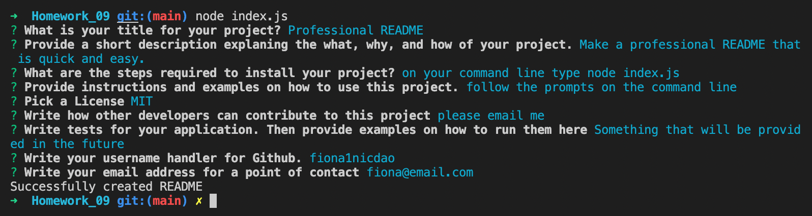
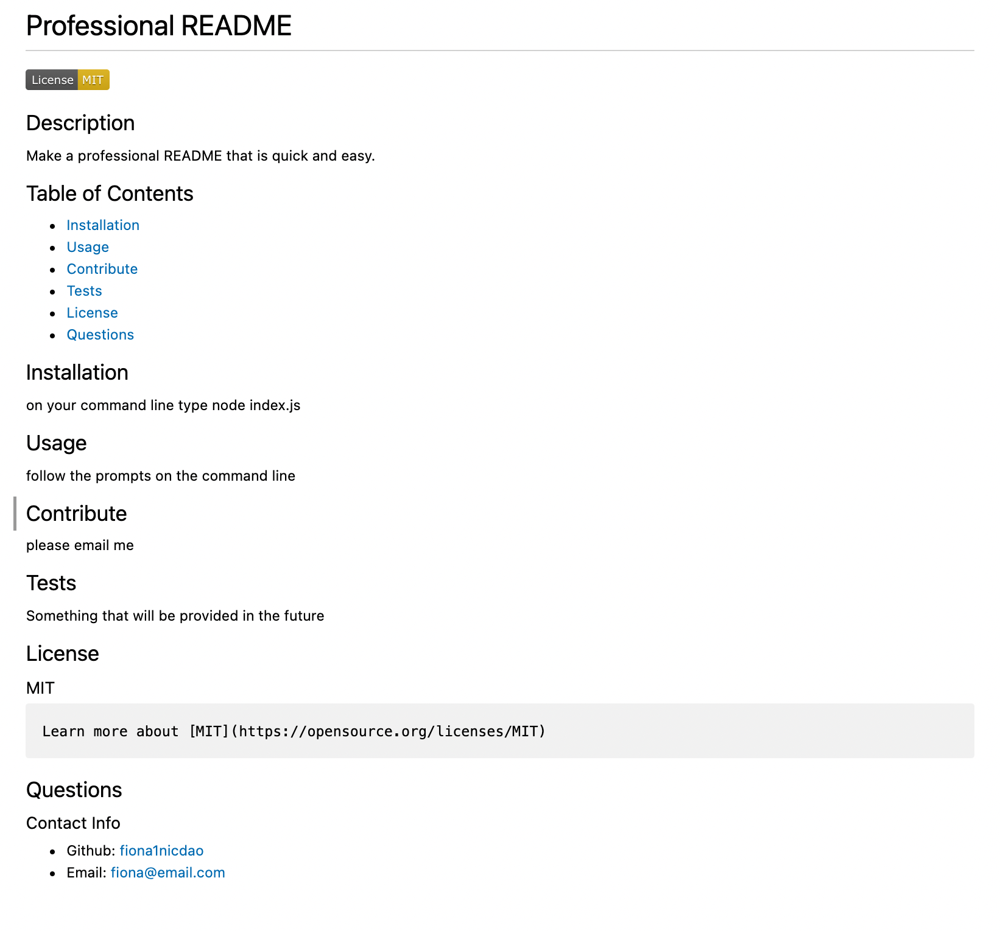

# Professional ReadME Generator
## Week 9:NodeJS


## Description
This project creates high-quality README for the app. The user is able to quickly create a professional README file by using the command-line application to generate one.
## Table of Contents
- [Installations](#Installations)
- [Usage](#Usage)
- [Links](#Links)
- [Preview](#Preview)

## Installations
The application will be invoked by using the following command:
```zsh
node index.js
```
## Licence 
 This project is licensed under the [MIT License](https://opensource.org/licenses/MIT).
 
## Usage
```md
GIVEN a command-line application that accepts user input 
WHEN prompted for information about my application repository
THEN a professional README.md is generated with a title for the users project, description, table of contents, installation section, usage section, contribute section, tests section, license section, and questions section
```
## Links 
### Link to [Walkthrough video](https://watch.screencastify.com/v/1aeptql6HzJm2TMUsYfn)
### Link to [GitHub Respository](https://github.com/fiona1nicdao/Homework_09)

## Preview
### Command line example 


### README example 


